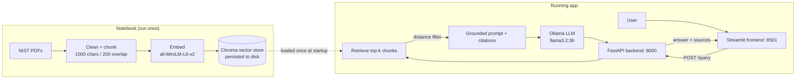
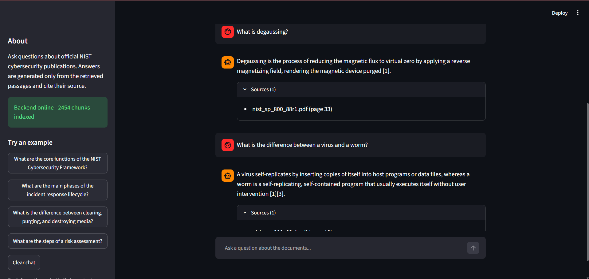
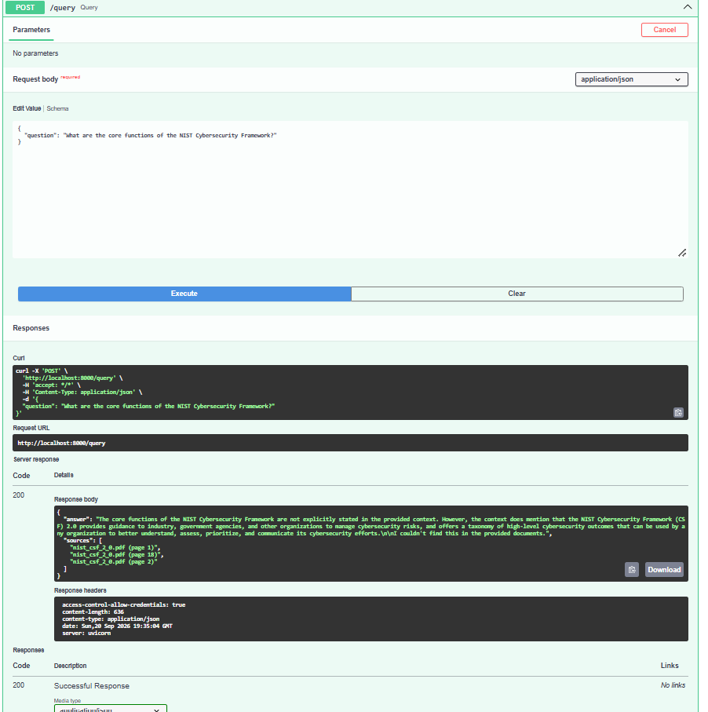

# 🛡️ Cybersecurity Guidelines Assistant (RAG)

A Retrieval-Augmented Generation web app that answers questions about official **NIST cybersecurity publications**. Every answer is generated by a **local LLM (Ollama)** *only* from passages retrieved from the documents, and it **cites the source file and page**. If the documents don't contain the answer, the assistant says so instead of guessing.

> Level 2 Summer Training — Graduation Project (Core Track)

## Table of contents
1. [Architecture](#architecture)
2. [Tech stack](#tech-stack)
3. [Project structure](#project-structure)
4. [Domain & data](#domain--data)
5. [Setup](#setup)
6. [Environment variables](#environment-variables)
7. [API reference](#api-reference)
8. [Evaluation results](#evaluation-results)
9. [Screenshots](#screenshots)
10. [Tests](#tests) · [Docker](#docker-optional) · [Troubleshooting](#troubleshooting)

## Architecture



**Grounding safeguards:** strict system prompt ("use ONLY the context, otherwise refuse") · low temperature (0.1) · cosine-distance threshold that skips the LLM entirely when nothing relevant is retrieved · numbered context chunks `[1]`, `[2]` that the model must cite.

## Tech stack

| Layer | Tools |
|---|---|
| Documents | NIST PDFs, `pypdf` |
| Embeddings | `sentence-transformers` (`all-MiniLM-L6-v2`) |
| Vector DB | Chroma (persistent, cosine distance) |
| LLM | Ollama, `llama3.2:3b` (runs locally) |
| Backend | FastAPI, Uvicorn, Pydantic / pydantic-settings |
| Frontend | Streamlit |
| Testing | pytest, FastAPI `TestClient` |

## Project structure

```
rag-assistant-project/
├── README.md
├── .gitignore
├── requirements-notebook.txt        # notebook dependencies
├── data/raw_pdfs/                   # put the NIST PDFs here (not committed)
├── notebooks/rag_pipeline.ipynb     # clean → chunk → embed → retrieve → evaluate → export
├── scripts/download_pdfs.py         # optional: downloads the PDFs for you
├── backend/
│   ├── app/
│   │   ├── main.py                  # FastAPI app, CORS, lifespan startup loading
│   │   ├── api/routes/query.py      # GET /health, POST /query
│   │   ├── core/config.py           # settings from .env
│   │   ├── schemas/query.py         # QueryRequest / QueryResponse
│   │   ├── services/retrieval.py    # load vector store, retrieve chunks
│   │   ├── services/generation.py   # prompt + Ollama call + citations
│   │   └── utils/logging_config.py
│   ├── data/vector_store/           # produced by the notebook (chroma/ + config.json)
│   ├── tests/test_query.py
│   ├── requirements.txt
│   ├── .env.example
│   └── Dockerfile
├── frontend/
│   ├── app.py                       # Streamlit chat UI
│   ├── api_client.py                # wrapper for the backend API
│   ├── requirements.txt
│   └── .env.example
└── docs/                            # screenshots + evaluation_results.*
```

## Domain & data

**Domain:** cybersecurity guidance from the U.S. National Institute of Standards and Technology (NIST). These are free public-domain PDFs with real, specific answers (frameworks, lifecycle phases, requirements), so grounded answers are easy to verify.

The raw PDFs are **not committed** to this repo (large files). Download them into `data/raw_pdfs/`, either automatically with `python scripts/download_pdfs.py`, or manually from the table below **using exactly these filenames** (they appear in the citations):

| Save as | Publication | Link |
|---|---|---|
| `nist_csf_2_0.pdf` | NIST Cybersecurity Framework (CSF) 2.0 | https://nvlpubs.nist.gov/nistpubs/CSWP/NIST.CSWP.29.pdf |
| `nist_sp_800_61r2.pdf` | SP 800-61 Rev. 2 — Computer Security Incident Handling Guide | https://nvlpubs.nist.gov/nistpubs/SpecialPublications/NIST.SP.800-61r2.pdf |
| `nist_sp_800_63b_4.pdf` | SP 800-63B-4 — Digital Identity Guidelines: Authentication | https://nvlpubs.nist.gov/nistpubs/SpecialPublications/NIST.SP.800-63B-4.pdf |
| `nist_sp_800_30r1.pdf` | SP 800-30 Rev. 1 — Guide for Conducting Risk Assessments | https://nvlpubs.nist.gov/nistpubs/Legacy/SP/nistspecialpublication800-30r1.pdf |
| `nist_sp_800_40r4.pdf` | SP 800-40 Rev. 4 — Enterprise Patch Management Planning | https://nvlpubs.nist.gov/nistpubs/SpecialPublications/NIST.SP.800-40r4.pdf |
| `nist_sp_800_83r1.pdf` | SP 800-83 Rev. 1 — Malware Incident Prevention and Handling | https://nvlpubs.nist.gov/nistpubs/SpecialPublications/NIST.SP.800-83r1.pdf |
| `nist_sp_800_88r1.pdf` | SP 800-88 Rev. 1 — Guidelines for Media Sanitization | https://nvlpubs.nist.gov/nistpubs/SpecialPublications/NIST.SP.800-88r1.pdf |
| `nist_sp_800_34r1.pdf` | SP 800-34 Rev. 1 — Contingency Planning Guide | https://nvlpubs.nist.gov/nistpubs/Legacy/SP/nistspecialpublication800-34r1.pdf |
| `nist_ir_7621r1.pdf` | NISTIR 7621 Rev. 1 — Small Business Information Security: The Fundamentals | https://nvlpubs.nist.gov/nistpubs/ir/2016/NIST.IR.7621r1.pdf |

> If a link is dead (NIST occasionally moves files), search the title at <https://csrc.nist.gov/publications> and save the PDF under the filename above. Any text-based PDF works — you can also add your own.

## Setup

**Prerequisites:** Python 3.11+ (3.12 recommended), [Ollama](https://ollama.com), Git.

### 1. Clone and create a virtual environment
```bash
git clone https://github.com/<your-username>/rag-assistant-app.git
cd rag-assistant-app
python -m venv .venv
.venv\Scripts\activate            # Windows
# source .venv/bin/activate       # macOS / Linux
```

### 2. Get the LLM and the documents
```bash
ollama pull llama3.2:3b
python scripts/download_pdfs.py   # or download manually — see "Domain & data"
```

### 3. Build the vector store (run the notebook once)
```bash
pip install -r requirements-notebook.txt
jupyter notebook notebooks/rag_pipeline.ipynb
```
Use **Kernel → Restart & Run All**. It writes the vector store and `config.json` to `backend/data/vector_store/`. (If you cloned a repo that already contains that folder, you can skip this step.)

### 4. Start the backend (terminal 1)
```bash
cd backend
pip install -r requirements.txt
cp .env.example .env              # Windows: copy .env.example .env
uvicorn app.main:app --reload
```
Open <http://localhost:8000/docs> to try the API in Swagger UI.

### 5. Start the frontend (terminal 2)
```bash
cd frontend
pip install -r requirements.txt
cp .env.example .env              # Windows: copy .env.example .env
streamlit run app.py
```
Open <http://localhost:8501> and ask a question.

> Ollama must be running (the desktop app or `ollama serve`). The first question can take a while because the model loads into memory.

## Environment variables

**Backend** (`backend/.env`)

| Variable | Default | Description |
|---|---|---|
| `OLLAMA_HOST` | `http://localhost:11434` | Ollama server URL |
| `OLLAMA_MODEL` | `llama3.2:3b` | Model used for generation |
| `TEMPERATURE` | `0.1` | Low = fewer hallucinations |
| `VECTOR_STORE_DIR` | `data/vector_store` | Folder exported by the notebook |
| `TOP_K` | `4` | Chunks retrieved per question |
| `MAX_DISTANCE` | `0.65` | Chunks farther than this (cosine distance) count as irrelevant |
| `CORS_ORIGINS` | `http://localhost:8501,http://127.0.0.1:8501` | Allowed frontend origins |
| `LOG_LEVEL` | `INFO` | Logging level |

**Frontend** (`frontend/.env`)

| Variable | Default | Description |
|---|---|---|
| `API_BASE_URL` | `http://localhost:8000` | Backend URL (never hard-coded in the code) |

## API reference

### `GET /health`
```bash
curl http://localhost:8000/health
# {"status":"ok","vector_store_loaded":true,"chunks":1234}
```

### `POST /query`
Request body: `{"question": "<3–1000 characters>"}`

```bash
curl -X POST http://localhost:8000/query \
  -H "Content-Type: application/json" \
  -d '{"question": "What are the core functions of the NIST Cybersecurity Framework?"}'
```
Response:
```json
{
  "answer": "The CSF 2.0 core has six functions: Govern, Identify, Protect, Detect, Respond and Recover [1].",
  "sources": ["nist_csf_2_0.pdf (page 8)"]
}
```

| Status | Meaning |
|---|---|
| `200` | Answer returned (may be *"I couldn't find this in the provided documents."* with empty `sources`) |
| `422` | Invalid input (missing/too short/too long question) |
| `503` | The LLM (Ollama) is unreachable or the model isn't pulled |

## Evaluation results

<!-- After running the notebook, paste the table from docs/evaluation_results.md here
     and fill in the summary + failure cases below. -->

*Results of the 10 in-scope + 3 out-of-scope test questions from `notebooks/rag_pipeline.ipynb` (section 2.6). Full table with answers: [`docs/evaluation_results.csv`](docs/evaluation_results.csv).*

| # | Question | Retrieved source | Correct |
|---|---|---|---|
| … | *(paste from `docs/evaluation_results.md`)* | … | … |

**Summary:** *X/10 in-scope questions answered correctly and grounded; 3/3 out-of-scope questions correctly refused.*

**Main failure cases & mitigations:** *(write 3–4 sentences: e.g. tables extracting badly, neighbouring documents retrieved, citation format drift, and how the distance threshold / prompt / chunking mitigated them).*

## Screenshots

<!-- Save screenshots in docs/screenshots/ and reference them like this: -->
<!--  -->
<!--  -->

*(add: the chat UI showing a cited answer, a refusal on an out-of-scope question, and the Swagger `/docs` page)*

## Tests

```bash
cd backend
pytest -q
```
The tests replace the retriever/generator with fakes, so they need neither Ollama nor the vector store. They cover the happy path, invalid input (422), the "nothing relevant → refuse without calling the LLM" path, and `/health`.

## Docker (optional)

```bash
cd backend
docker build -t rag-backend .
docker run -p 8000:8000 -e OLLAMA_HOST=http://host.docker.internal:11434 rag-backend
```
The vector store (`backend/data/vector_store/`) must exist before building the image. Ollama keeps running on the host machine.

## Troubleshooting

| Problem | Fix |
|---|---|
| Backend fails at startup with "Vector store not found" | Run the notebook first (step 3) so `backend/data/vector_store/` is populated |
| `/query` returns 503 | Start Ollama and run `ollama pull llama3.2:3b` |
| Frontend shows "Backend offline" | Start the backend and check `API_BASE_URL` in `frontend/.env` |
| Everything gets refused | `MAX_DISTANCE` is too strict — raise it slightly (tune it in the notebook) |
| A PDF has almost no text | It's a scan and needs OCR — replace it with a text-based PDF |
